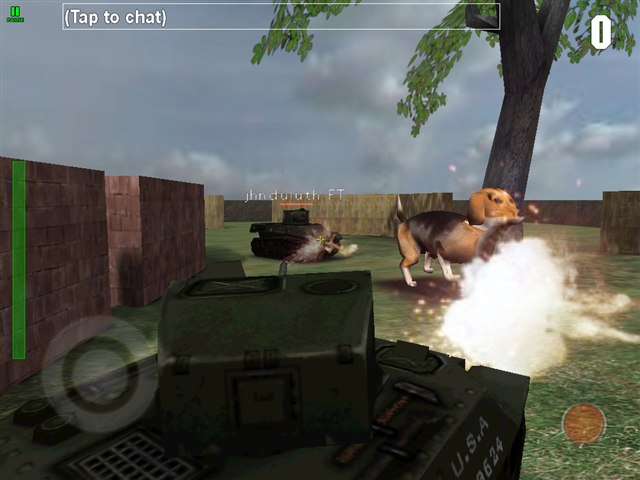
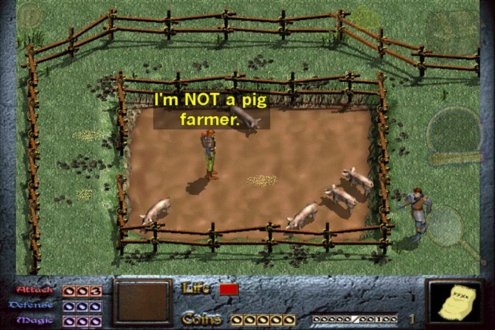
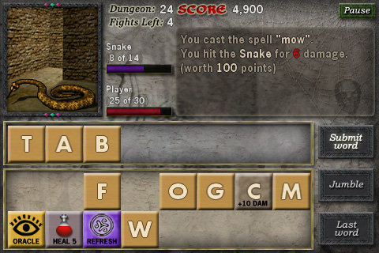
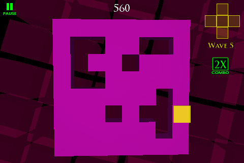

  <picture>
    <source media="(prefers-color-scheme: dark)" srcset="docs/readme_media/proton_logo_dark.png">
    
  </picture>

## For tutorials and more info, visit [The Proton SDK wiki](https://www.protonsdk.com)

License: [BSD style with attribution required](https://github.com/SethRobinson/proton/blob/master/license.txt)

Seth's GL/GLES messy multi-platform C++ game SDK.  Can output to **Windows**, **Linux** (including the **Raspberry Pi**), **HTML5**, **OS X**,  **iOS**, **Android**

A component based toolbox of useful things built up over the last SEVENTEEN years.  Instead of a giant .lib you link only the .cpp files used when possible to simplify multiplatform support as well as keep code size down.

It's kind of a SDL-like on steroids (while also being able to target SDL2 for setup/input/audio itself when needed) but generally gets the best results with its own native implementations of things. For example, it can target the following audio subsystems: SDL2_mixer, Audiere, FMOD, FMODStudio, Native iOS, Native Android, Denshion.  It's mostly written in C++.

It's designed with a "Write stuff in Windows, then compile/export to other platforms as needed" mentality.

  
  
  
  

Some things written with Proton: <a href="https://www.rtsoft.com/pages/tanked.php">Tanked</a>, <a href="https://www.rtsoft.com/pages/dink.php">Dink Smallwood HD</a>, <a href="https://www.rtsoft.com/pages/dscroll_mobile.php">Dungeon Scroll</a>, <a href="https://www.codedojo.com/?p=138">Mind Wall</a>

Deprecated platforms no longer actively supported:  Flash, BBX, WebOS

### 8/30/2026 Note - the renderer got modernized

Proton SDK has been GL 1.x/GLES1 until now because when I wrote it (2009?) and have been too lazy to ever update it, but today that changes!

See, I need a fancy shader for something and I want to use Proton SDK, so it's been modified to support a GLES2-class render pipeline alongside the old fixed-function GL 1.x/GLES1 path.

The important part: **existing app code needs no changes**, a compatibility shim remaps the fixed-function gl* calls apps make onto the new pipeline, and the regression suite verifies both paths render pixel-identical. 

What this gets you:

* **Custom GLSL shaders** in your app via the new `RTShader` class + `SetActiveShader()`, and **render-to-texture** via `Surface::InitRenderTarget()`.  See the new **RTShader** example app for a short, heavily commented tour that runs on every supported platform: full-screen post-process effects, plus the same 3D cube drawn twice - once with classic fixed-function-style GL calls (no GPU code, the built-in math) and once through a custom vertex+fragment shader that bends it like jelly, so you can flip between them and SEE the difference.
* The shader pipeline is the **default** in projects that compile it in (all the included demo apps).  On desktop builds you can launch with `-fixedpipeline` to compare against the legacy path, which is still fully intact. (for now)  If for some reason you REALLY want to use the old path, you can define `PROTON_USE_FIXED_PIPELINE` in your project to force it.
* iOS and Android now build as pure GLES2, and **HTML5 targets WebGL directly instead of LEGACY_GL_EMULATION**, granting us speed gains across the board.

The pre-shader engine is tagged `v1.0.0` if you need the old baseline. 

### 8/29/2023 Note

I had to make a breaking change - I updated the Boost library to the latest for proper C++20 support and it doesn't support signal anymore, just signals2.

If you're updating an old project, When you get this error:

1>c1xx : fatal  error C1083: Cannot open source file: '..\..\shared\util\boost\libs\signals\src\connection.cpp': No such file or directory
1>named_slot_map.cpp
1>c1xx : fatal  error C1083: Cannot open source file: '..\..\shared\util\boost\libs\signals\src\named_slot_map.cpp': No such file or directory
1>signal_base.cpp
1>c1xx : fatal  error C1083: Cannot open source file: '..\..\shared\util\boost\libs\signals\src\signal_base.cpp': No such file or directory
1>slot.cpp
1>c1xx : fatal  error C1083: Cannot open source file: '..\..\shared\util\boost\libs\signals\src\slot.cpp': No such file or directory
1>trackable.cpp
1>c1xx : fatal  error C1083: Cannot open source file: '..\..\shared\util\boost\libs\signals\src\trackable.cpp': No such file or directory

Remove references to those files, they don't exist anymore, signals2 is header-only, no source needed.

If you get errors like "1>D:\projects\proton\UGT\Source\App.h(132,9): error C2039: 'signal': is not a member of 'boost'" in your code, you'll need to change it.

From this:

	boost::signal<void(void)> m_sig_target_language_changed;

To this:

	boost::signals2::signal<void(void)> m_sig_target_language_changed;

Some things written with Proton:

* [Growtopia](https://www.growtopiagame.com) - 2D MMO, a good example of using Proton's GUI for many screen sizes.
* [Dungeon Scroll](https://www.rtsoft.com/pages/dscroll_mobile.php) - A word game.  ([HTML5 version](http://www.dungeonscroll.com))
* [Dink Smallwood](https://www.rtsoft.com/pages/dink.php) - Good example of porting old code to Proton to add touch controls and multiplatform support. Open source. [HTML5 version](https://www.rtsoft.com/web/dink)
* [Mind Wall](https://www.codedojo.com/?p=138) - 3D puzzle game
* [Tanked](https://www.rtsoft.com/pages/tanked.php) - 3D multiplayer tank combat game including four player split screen support as well as internet match making.
* Arduboy Simulator - Allows you to write and debug [Arduboy](arduboy.com) apps with MSVC as well as output HTML5 playable versions (included with [Proton SDK](https://www.arduboy.com)) [HTML5 Example game](http://www.rtsoft.com/arduman.html)

Credits and links

- [Proton SDK wiki/tutorial site](https://www.protonsdk.com)
- Seth A. Robinson (seth@rtsoft.com) (Wrote most of Proton SDK) ([Codedojo](https://www.codedojo.com), Seth's blog)
- Aki Koskinen (Contibutions to Linux support, SpriteAnim, documentation)
- [Clanlib team](https://github.com/sphair/ClanLib/blob/master/CREDITS) (Some math functions were taken from Clanlib)
- Dan Walma (contributions to SoftSurface)
- Fatalfeel's [Proton SDK forks](https://github.com/fatalfeel) for GLES 2 support and Cocos2D integration
- Vita platform support by @NabsiYa
- Mateus Sales Bentes (@mateusbentes) (Mac support improvements)

#### AI Disclosure

This project was developed with assistance from AI tools. (well, starting in August 2026) I mean, you can still blame me (Seth) for bugs, but I just wanted to mention it.

#### Want to contribute?

Well, these days it's generally easier for me to get a bug report and fix it myself as I can test on six platforms automatically, rather than a PR.  But as with any of my stuff, fork away!